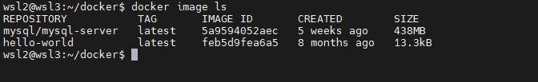

# MIGRATION TO THE СLOUD WITH CONTAINERIZATION. PART 1 – DOCKER AND DOCKER COMPOSE #

## Install Docker and prepare for migration to the Cloud ##
**Install from a Package**

Go to https://download.docker.com/linux/ubuntu/dists/, choose your Ubuntu version, then browse to pool/stable/, choose amd64, armhf, arm64, or s390x, and download the .deb file for the Docker Engine version you want to install.

Install Docker Engine, changing the path below to the path where you downloaded the Docker package.
~~~
 sudo dpkg -i /path/to/package.deb
~~~

The Docker daemon starts automatically.

Verify that Docker Engine is installed correctly by running the hello-world image.
~~~
 sudo docker run hello-world
~~~
This command downloads a test image and runs it in a container. When the container runs, it prints a message and exits.

** Manage Docker as non-root user
The Docker daemon binds to a Unix socket instead of a TCP port. By default that Unix socket is owned by the user root and other users can only access it using sudo. 
The Docker daemon always runs as the root user.

If you don’t want to preface the docker command with sudo, create a Unix group called docker and add users to it. When the Docker daemon starts, 
it creates a Unix socket accessible by members of the docker group.

To create the docker group and add your user:

Create the docker group.
~~~
 sudo groupadd docker
~~~
Add your user to the docker group.
~~~
 sudo usermod -aG docker $USER
~~~
Log out and log back in so that your group membership is re-evaluated.

If testing on a virtual machine, it may be necessary to restart the virtual machine for changes to take effect.

On a desktop Linux environment such as X Windows, log out of your session completely and then log back in.

On Linux, you can also run the following command to activate the changes to groups:
~~~
 newgrp docker 
~~~
Verify that you can run docker commands without sudo.

~~~
docker run hello-world
~~~

### **MySQL in container** ###

Let us start assembling our application from the Database layer – we will use a pre-built MySQL database container, configure it, and make sure it is ready to receive requests from our PHP application.

**Step 1: Pull MySQL Docker Image from Docker Hub Registry**
Start by pulling the appropriate Docker image for MySQL. You can download a specific version or opt for the latest release, as seen in the following command:
~~~
docker pull mysql/mysql-server:latest
~~~
List the images with
~~~
docker image ls
~~~

**Step 2: Deploy the MySQL Container to your Docker Engine**

1. Once you have the image, move on to deploying a new MySQL container with:
~~~
docker run --name <container_name> -e MYSQL_ROOT_PASSWORD=<my-secret-pw> -d mysql/mysql-server:latest
~~~
-  Replace <container_name> with the name of your choice. If you do not provide a name, Docker will generate a random one
-  The -d option instructs Docker to run the container as a service in the background
-  Replace <my-secret-pw> with your chosen password
-  In the command above, we used the latest version tag. This tag may differ according to the image you downloaded
2. Then, check to see if the MySQL container is running: Assuming the container name specified is mysql-server
 ~~~
 docker ps -a
 ~~~
 
 
**Step 3: Connecting to the MySQL Docker Container**
We can either connect directly to the container running the MySQL server or use a second container as a MySQL client. Let us see what the first option looks like.

**Approach 1**

Connecting directly to the container running the MySQL server:
~~~
 $ docker exec -it mysql bash
or
$ docker exec -it mysql mysql -uroot -p
~~~

Provide the root password when prompted. With that, you’ve connected the MySQL client to the server.

Finally, change the server root password to protect your database. Exit the the shell with exit command

Flags used

- exec used to execute a command from bash itself
- -it makes the execution interactive and allocate a pseudo-TTY
- bash this is a unix shell and its used as an entry-point to interact with our container
- mysql The second mysql in the command "docker exec -it mysql mysql -uroot -p" serves as the entry point to interact with mysql container just like bash or sh
- -u mysql username
- -p mysql password
 
**Approach 2**

At this stage you are now able to create a docker container but we will need to add a network. So, stop and remove the previous mysql docker container.
~~~
docker ps -a
docker stop mysql 
docker rm mysql or <container ID>
~~~
verify that the container is deleted
~~~
 docker ps -a
~~~

 
First, create a network:
~~~
 $ docker network create --subnet=172.18.0.0/24 tooling_app_network 
~~~
Creating a custom network is not necessary because even if we do not create a network, Docker will use the default network for all the containers you run. By default, the network we created above is of DRIVER Bridge. So, also, it is the default network. You can verify this by running the docker network ls command.

But there are use cases where this is necessary. For example, if there is a requirement to control the cidr range of the containers running the entire application stack. This will be an ideal situation to create a network and specify the --subnet

For clarity’s sake, we will create a network with a subnet dedicated for our project and use it for both MySQL and the application so that they can connect.

Run the MySQL Server container using the created network.

First, let us create an environment variable to store the root password:
~~~
 export MYSQL_PW=
~~~
Verify with
~~~
 echo $MYSQL_PW
~~~
 
 
 
Then, pull the image and run the container, all in one command like below:
~~~
 $ docker run --network tooling_app_network -h mysqlserverhost --name=mysql-server -e MYSQL_ROOT_PASSWORD=$MYSQL_PW  -d mysql/mysql-server:latest 
~~~
Flags used

- -d runs the container in detached mode
- --network connects a container to a network
- -h specifies a hostname
If the image is not found locally, it will be downloaded from the registry.

Verify the container is running:
~~~
 $ docker ps -a 
~~~

It is best practice not to connect to the MySQL server remotely using the root user. Therefore, we will create an SQL script that will create a user we can use to connect remotely.

Create a file and name it create_user.sql and add the below code in the file:
~~~
 $ CREATE USER ''@'%' IDENTIFIED BY ''; GRANT ALL PRIVILEGES ON * . * TO ''@'%'; 
~~~
Run the script:
Ensure you are in the directory create_user.sql file is located or declare a path
~~~
 $ docker exec -i mysql-server mysql -uroot -p$MYSQL_PW < create_user.sql 
~~~
If you see a warning like below, it is acceptable to ignore:
~~~
 mysql: [Warning] Using a password on the command line interface can be insecure.
~~~

### Connecting to the MySQL server from a second container running the MySQL client utility ###
                                                                         
The good thing about this approach is that you do not have to install any client tool on your laptop, and you do not need to connect directly to the 
container running the MySQL server.

Run the MySQL Client Container:
~~~
 $ docker run --network tooling_app_network --name mysql-client -it --rm mysql mysql -h mysqlserverhost -u bayo -p 
~~~
Flags used:

- --name gives the container a name
- -it runs in interactive mode and Allocate a pseudo-TTY
- --rm automatically removes the container when it exits
- --network connects a container to a network
- -h a MySQL flag specifying the MySQL server Container hostname
- -u user created from the SQL script
- admin username-for-user-created-from-the-SQL-script-create_user.sql
- -p password specified for the user created from the SQL script

                                                                         
### Prepare database schema ###
Now you need to prepare a database schema so that the Tooling application can connect to it.

1. Clone the Tooling-app repository from here
~~~                                                                         
 $ git clone https://github.com/darey-devops/tooling.git 
~~~
2. On your terminal, export the location of the SQL file
~~~                                                                         
 $ export tooling_db_schema=/tooling_db_schema.sql 
~~~
You can find the tooling_db_schema.sql in the tooling/html/tooling_db_schema.sql folder of cloned repo.

Verify that the path is exported
~~~
 echo $tooling_db_schema
~~~
                                                                         

3. Use the SQL script to create the database and prepare the schema. With the docker exec command, you can execute a command in a running container.
~~~ 
 $ docker exec -i mysql-server mysql -uroot -p$MYSQL_PW < $tooling_db_schema 
~~~
 
4. Update the .env file with connection details to the database
 
The .env file is located in the html tooling/html/.env folder but not visible in terminal. you can use vi or nano
~~~
sudo vi .env

MYSQL_IP=mysqlserverhost
MYSQL_USER=username
MYSQL_PASS=client-secrete-password
MYSQL_DBNAME=toolingdb
~~~
Flags used:

- MYSQL_IP mysql ip address "leave as mysqlserverhost"
- MYSQL_USER mysql username for user export as environment variable
- MYSQL_PASS mysql password for the user exported as environment varaible
- MYSQL_DBNAME mysql databse name "toolingdb"

 5. Run the Tooling App
Containerization of an application starts with creation of a file with a special name - 'Dockerfile' (without any extensions). This can be considered 
as a 'recipe' or 'instruction' that tells Docker how to pack your application into a container. In this project, you will build your container from a 
pre-created Dockerfile, but as a DevOps, you must also be able to write Dockerfiles.

You can watch [this video](https://www.youtube.com/watch?v=hnxI-K10auY) to get an idea how to create your Dockerfile and build a container from it.
So, let us containerize our Tooling application; here is the plan:

- Make sure you have checked out your Tooling repo to your machine with Docker engine
- First, we need to build the Docker image the tooling app will use. The Tooling repo you cloned above has a Dockerfile for this purpose. Explore it 
  and make sure you understand the code inside it.
- Run docker build command
- Launch the container with docker run
- Try to access your application via port exposed from a container
 
Let us begin:

Ensure you are inside the directory "tooling" that has the file Dockerfile and build your container :
~~~
 $ docker build -t tooling:0.0.1 . 
~~~
In the above command, we specify a parameter -t, so that the image can be tagged tooling"0.0.1 - Also, you have to notice the . at the end. This is important as that tells Docker to locate the Dockerfile in the current directory you are running the command. Otherwise, you would need to specify the absolute path to the Dockerfile.
 
6. Run the container:
~~~
 $ docker run --network tooling_app_network -p 8085:80 -it tooling:0.0.1 
~~~
Let us observe those flags in the command.

- We need to specify the --network flag so that both the Tooling app and the database can easily connect on the same virtual network we created earlier.
- The -p flag is used to map the container port with the host port. Within the container, apache is the webserver running and, by default, it listens on port 80. You   can confirm this with the CMD **["start-apache"]** section of the Dockerfile. But we cannot directly use port 80 on our host machine because it is already in use. The workaround is to use another port that is not used by the host machine. In our case, port 8085 is free, so we can map that to port 80 running in the container.
Note: You will get an error. But you must troubleshoot this error and fix it. Below is your error message. 

 If everything works, you can open the browser and type http://localhost:8085

You will see the login page.

 
 #### PRACTICE TASKS ####
 
 PART 1
 
 Write a Dockerfile for the TODO app (see the complete project folder)
 Create a network for the project:
 ~~~
 docker network create --subnet=172.30.0.0/24 todo-network
 ~~~
 
 export password and create a database user and a database with this script
~~~
 export MYSQL_PS=password
 ~~~
 
 Run the database container with:
 
 ~~~
 docker run --network todo-network -h mysqlserverhost --name=mysql-server -e MYSQL_ROOT_PASSWORD=$MYSQL_PS  -d mysql/mysql-server:5.7.22
 ~~~
 -h assigns hostname to the mysql container
 
 Create a file and name it create_user.sql and add the below code in the file:
~~~
 CREATE USER 'todo'@'%' IDENTIFIED BY 'password'; GRANT ALL PRIVILEGES ON * . * TO 'todo'@'%';
 
 CREATE DATABASE tododb;
~~~

 Run the command below to create a database **(tododb)** and database user **(todo)**
~~~
 sudo git clone https://github.com/darey-devops/php-todo
~~~
 To download the project directory into your workspace
 
 Create files that will hold commands to be run in the todo app container, like the .env (holds dabase connection parametes, enviromnet file), start-apache.sh (holds commands to start php) Dockerfile. See samples in the project directory.
 Navigate to the folder holding the Dockerfile, run the command below to create an image
~~~
 docker build -t todo:0.1 .
~~~
 Start a container based on the image created above
~~~
 docker run --network todo-network -p 8000:8000 -it todo:0.1
~~~
 
 Go to http://localhost:8000
 

 
 PART 2
 
1. Create an account in Docker Hub
1. Create a new Docker Hub repository
1. Push the docker images from your PC to the repository
 

 
 PART 3
 
 * Connect your repo to Jenkins
 
 Repo connected to Jenkins using github credentials and repo url
 
 
 
 
* Create a multi-branch pipeline
 
 
